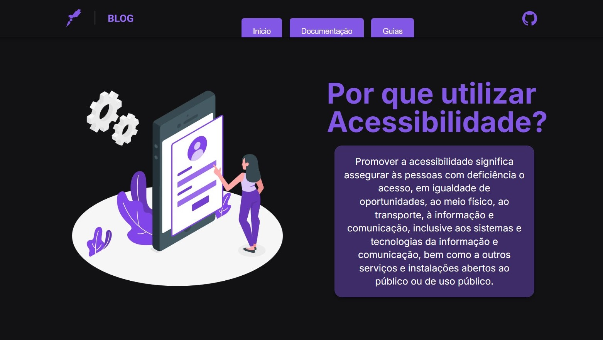

# Accessibility WEB Fundamentals

Ferramentas Utilizadas No Projeto
- React
- TypeScript
- Next.js
- Tailwind
- Flowbite
- Lucide
- @axe-core/react
- Ilustração Storyset

> O poder da Web está em sua universalidade. O acesso de todos, independentemente da deficiência, é um aspecto essencial.
*- TIM BERNERS-LEE (Criador da WEB)*
 
